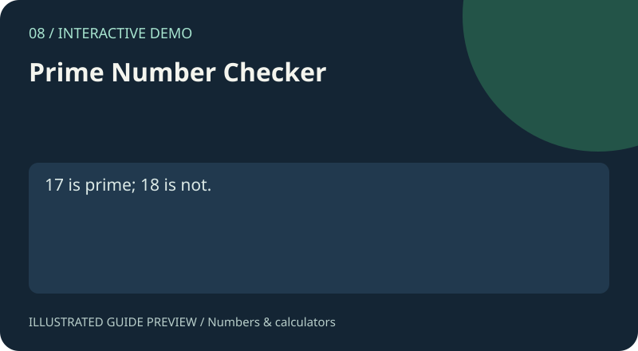

# 08. Prime Number Checker

[Project gallery](../index.html) · [Collection guide](../README.md) · [Open page](index.html)

**Status:** Interactive demo. An implementation exists and was reviewed from source; this is not certification of every input.



Prime number checker.

## Files and technology

- `index.html`: interface with embedded HTML, CSS and JavaScript.
- `README.md`: purpose, example, implementation and limits.
- Shared catalogue, navigation and preview assets live in `../assets/`.
No install or build step is required. Open this page locally or use the local-server command in the root guide.

## Try it

17 is prime; 18 is not.

Use the fields and controls shown on the page. Expand Project guide below the demo for the same example and scope notes.

## How it works

Try divisors up to the square root.

Source functions: `check()`.

## Scope and limitations

Use small nonnegative integers; large inputs can block the browser.

## Learning exercise

Trace the example through the source, try an empty input and a boundary case, and explain the result. Read the limits above before extending the demo.

The preview is an illustration of a documented use case, not a captured screenshot.

## Native C version

`main.c` provides a separate C11 command-line implementation. From the repository root, with GCC or Clang installed:

```sh
cc -std=c11 -Wall -Wextra -Werror 08-prime-checker/main.c -o prime
./prime 29
```

Expected output: `prime`. On Windows, use `prime.exe` as the output name and run `.\prime.exe`. Invalid arguments exit with status 1 and an error on stderr. See [native guide](../native/README.md) for numeric limits and automated compilation checks.
