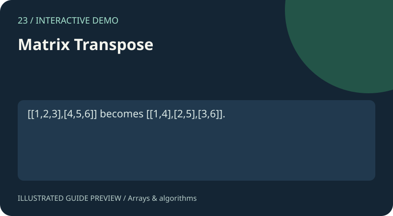

# 23. Matrix Transpose

[Project gallery](../index.html) · [Collection guide](../README.md) · [Open page](index.html)

**Status:** Interactive demo. An implementation exists and was reviewed from source; this is not certification of every input.

Transpose rows and columns.

## Files and technology

- `index.html`: interface with embedded HTML, CSS and JavaScript.
- `README.md`: purpose, example, implementation and limits.
- Shared catalogue, navigation and preview assets live in `../assets/`.
No install or build step is required. Open this page locally or use the local-server command in the root guide.

## Try it

[[1,2,3],[4,5,6]] becomes [[1,4],[2,5],[3,6]].

Use the fields and controls shown on the page. Expand Project guide below the demo for the same example and scope notes.

## How it works

Write [r,c] to [c,r].

Source functions: `build()`, `transpose()`.

## Scope and limitations

At most six rows/columns; select Set after changing size.

## Learning exercise

Trace the example through the source, try an empty input and a boundary case, and explain the result. Read the limits above before extending the demo.

The preview is an illustration of a documented use case, not a captured screenshot.

## Pseudocode and complexity

See the [Matrix Transpose lesson](../docs/ALGORITHMS.md#23-matrix-transpose) for a worked example, implementation costs and an exercise.
