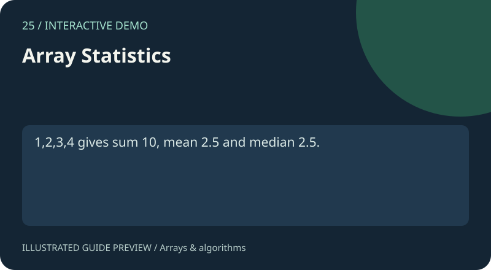

# 25. Array Statistics

[Project gallery](../index.html) · [Collection guide](../README.md) · [Open page](index.html)

**Status:** Interactive demo. An implementation exists and was reviewed from source; this is not certification of every input.



Count, sum, minimum, maximum, mean and median.

## Files and technology

- `index.html`: interface with embedded HTML, CSS and JavaScript.
- `README.md`: purpose, example, implementation and limits.
- Shared catalogue, navigation and preview assets live in `../assets/`.
No install or build step is required. Open this page locally or use the local-server command in the root guide.

## Try it

1,2,3,4 gives sum 10, mean 2.5 and median 2.5.

Use the fields and controls shown on the page. Expand Project guide below the demo for the same example and scope notes.

## How it works

Validate finite numbers, aggregate and sort a copy for median.


## Scope and limitations

At most 10000 entries; floating point results may round.

## Learning exercise

Trace the example through the source, try an empty input and a boundary case, and explain the result. Read the limits above before extending the demo.

The preview is an illustration of a documented use case, not a captured screenshot.

## Native C version

`main.c` provides a separate C11 command-line implementation. From the repository root, with GCC or Clang installed:

```sh
cc -std=c11 -Wall -Wextra -Werror 25-array-statistics/main.c -o statistics
./statistics 1 2 3 4
```

Expected output: `count=4 sum=10 min=1 max=4 mean=2.5 median=2.5`. On Windows, use `statistics.exe` as the output name and run `.\statistics.exe`. Invalid arguments exit with status 1 and an error on stderr. See [native guide](../native/README.md) for numeric limits and automated compilation checks.

## Actual screenshots

[Desktop](../assets/screenshots/25-array-statistics-desktop.png) · [Mobile](../assets/screenshots/25-array-statistics-mobile.png). See the [screenshot guide](../docs/SCREENSHOTS.md) for capture conditions.
