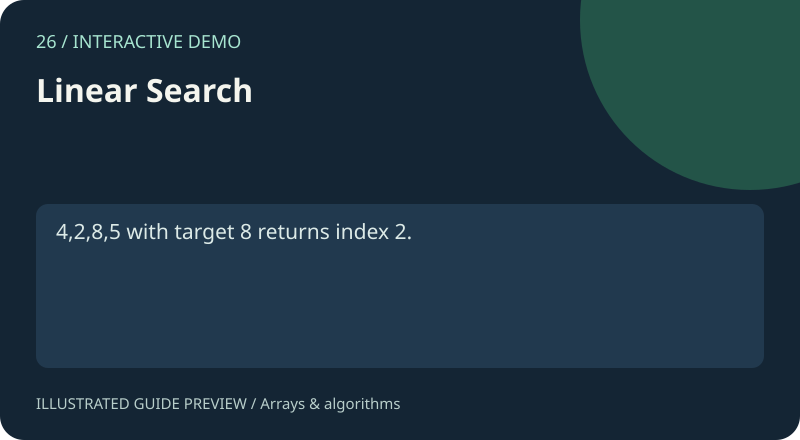

# 26. Linear Search

[Project gallery](../index.html) · [Collection guide](../README.md) · [Open page](index.html)

**Status:** Interactive demo. An implementation exists and was reviewed from source; this is not certification of every input.

Find the first matching integer.

## Files and technology

- `index.html`: interface with embedded HTML, CSS and JavaScript.
- `README.md`: purpose, example, implementation and limits.
- Shared catalogue, navigation and preview assets live in `../assets/`.
No install or build step is required. Open this page locally or use the local-server command in the root guide.

## Try it

4,2,8,5 with target 8 returns index 2.

Use the fields and controls shown on the page. Expand Project guide below the demo for the same example and scope notes.

## How it works

Scan until the first match.

Source functions: `search()`.

## Scope and limitations

Zero-based indices; integer parsing.

## Learning exercise

Trace the example through the source, try an empty input and a boundary case, and explain the result. Read the limits above before extending the demo.

The preview is an illustration of a documented use case, not a captured screenshot.

## Pseudocode, complexity and exercises

See the [Linear Search learning notes](../docs/ALGORITHMS.md#26-linear-search) for pseudocode, a worked example, time/space cost and an exercise.
