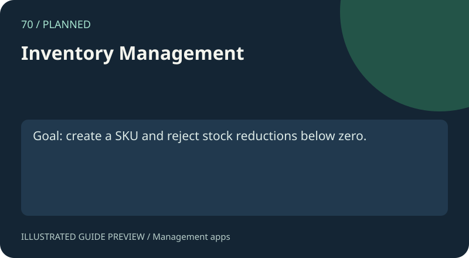

# 70. Inventory Management

[Gallery](../index.html) · [Open demo](index.html)

**Status: Demo** — Manage stock quantities, unit prices and total stock value.

## Try it

create a SKU and reject stock reductions below zero.

Add a record, search by any field, edit it, then delete it. IDs must be unique and all fields are required. Library records support borrow and return, and prevent borrowing a book twice. Inventory quantities are whole nonnegative numbers, and prices are nonnegative amounts with two decimal places.

## How it works

The interface in `index.html` uses `../assets/management.js` and the reusable validation and immutable record operations in `../assets/management-core.js`. Records use a versioned localStorage key. Invalid saved collections fall back to sample records with a visible notice. Values are rendered with textContent.

## Persistence and limits

This is a browser learning demo, with no login, server or shared database. Browser storage can be cleared or unavailable. Export JSON for a backup; importing backups is not implemented. At most 10000 records, and text fields are limited to 120 characters. Inventory quantities and prices are capped at 1000000. No real personal data is necessary.

## Checks and exercise

`npm test` checks validation, duplicate IDs, search and library loan operations. `npm run test:browser` checks each app in a real browser, including persistence. Exercise: add a validated JSON import with a confirmation preview.

