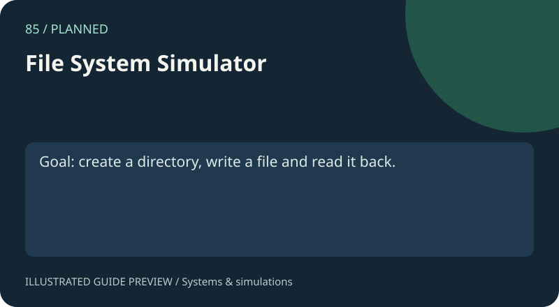

# 85. File System Simulator

[Project gallery](../index.html) · [Collection guide](../README.md) · [Open page](index.html)

**Status:** Planned. This is a project brief. The proposed functionality is not implemented.

Planned virtual file system.

## Files and technology

- `index.html`: project brief and checklist.
- `README.md`: purpose, example, implementation and limits.
- Shared catalogue, navigation and preview assets live in `../assets/`.
A future implementation may need an explicit native runtime. See the scope below.

## Acceptance example

Goal: create a directory, write a file and read it back.

This example is a development goal, not an available feature.

## Suggested approach

Represent directories and files as explicit node types.

## Scope and limitations

No file-system simulation implemented.

## Development checklist

- [ ] Define inputs, outputs and invalid-input behavior.
- [ ] Implement the acceptance example.
- [ ] Add validation, explanatory results and keyboard access.
- [ ] Document runtime, persistence and limits.
- [ ] Add meaningful checks before changing status to demo.

The preview is an illustration of the intended project, not a captured screenshot.
